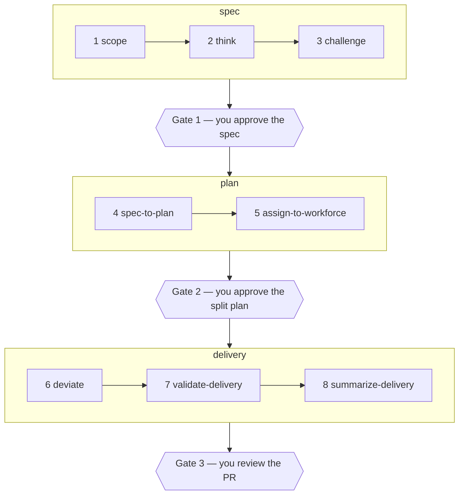

# associate

associate is a non-coding agent harness — a fast, reliable worker for **read,
summarize, and find** work across local files and the web. It exists to take
non-coding tool work off [`colleague`](https://github.com/agentculture/colleague)
so colleague can spend its budget on coding and thinking.

Modelled on the Pi harness, merged from colleague's base tools.

The name is not incidental: **`associate` is a first-class role in
[lobes](https://github.com/agentculture/lobes-cli)** — the tenth Colleague-facing
lobe, backed by `nvidia/NVIDIA-Nemotron-3.5-Lightning-30B-A3B-NVFP4` and defined
there as `worker` **minus** `repo_action`: it executes, drafts, inspects and calls
tools, then hands the result *back* rather than enacting it. This repo is the
agent harness for that role. The lane is live — a lobes gateway proxies it over
the tailnet to a Jetson AGX Orin 64GB running the `orin-associate` shape.

## Status: scaffold, not yet a harness

Read this before you install it. What ships today is the **agent-first CLI and
the skill kit** — introspection verbs, a mesh identity, and a green
build/test/publish baseline. The harness itself is not built: there is no read
verb, no summarize verb, no find verb, and no web fetch. Nothing here takes work
off colleague yet.

What *is* live is the model lane underneath it (see above) — the serving side is
ready and waiting for a harness to drive it.

The rest of this README describes what exists. See
[`CLAUDE.md`](CLAUDE.md) for what to build on top of it, and for the measured
topology of the lane.

## Quickstart

```bash
git clone https://github.com/agentculture/associate && cd associate
uv sync

uv run associate whoami               # who this agent is
uv run associate learn                # self-teaching prompt (add --json)
uv run pytest -n auto                 # the test suite
uv run teken cli doctor . --strict    # the agent-first rubric gate CI runs
```

## CLI

| Verb | What it does |
|------|--------------|
| `whoami` | Report this agent's nick, version, backend, and model from `culture.yaml`. |
| `learn` | Print a structured self-teaching prompt. |
| `explain <path>` | Markdown docs for any noun/verb path. |
| `overview` | Read-only descriptive snapshot of the agent. |
| `doctor` | Check the agent-identity invariants (prompt-file-present, backend-consistency). |
| `cli overview` | Describe the CLI surface itself. |

Every command takes `--json`. **Results go to stdout, errors and diagnostics go
to stderr — never mixed**, so an agent parsing the output can rely on it. Errors
in JSON mode are `{code, message, remediation}`; in text mode they are an
`error:` line and a `hint:` line. Exit codes: `0` success, `1` user error, `2`
environment error, `3+` reserved.

The runtime package has **no third-party dependencies** — it installs and starts
fast, which is the whole point of a harness.

## What you get

- **An agent-first CLI** cited from [teken](https://github.com/agentculture/teken)
  (`afi-cli`), with the stdout/stderr, `--json`, error-shape, and
  learnability contract above enforced in CI by `teken cli doctor --strict`.
- **A mesh identity** — `culture.yaml` (`suffix` + `backend` + `model`) and the
  matching resident prompt file. associate runs `backend: colleague`, so the
  resident prompt is [`AGENTS.colleague.md`](AGENTS.colleague.md);
  [`CLAUDE.md`](CLAUDE.md) is the prompt for Claude Code sessions working *on*
  the repo. Both audiences are real.
- **19 skills** under `.claude/skills/`, vendored cite-don't-import. Provenance
  for every one is tracked in [`docs/skill-sources.md`](docs/skill-sources.md).
- **A build + deploy baseline** — pytest, four linters, markdownlint, the rubric
  gate, SonarCloud, and PyPI Trusted Publishing wired into GitHub Actions.

## Skills

Eight of the vendored skills form one workflow, not eight independent tools.
They come from [`devague`](https://github.com/agentculture/devague) and carry an
idea from vague to accounted-for:



Three gates are yours: the spec, the split plan, the PR. Inside them you also
adjudicate — every proposal the agent files waits for your confirm, and a mid-run
deviation waits for your approval. Everything else is the agent's, and all of it
is written down. Nothing is deleted to go green: unknowns are parked, questions
are resolved, failures are reported faithfully.

The other eleven cover the day-to-day:

| Skill | What it's for |
|-------|---------------|
| `cicd` | The PR lane — open, read review comments, reply, and gate on SonarCloud. |
| `communicate` | File issues on sibling repos and send messages to Culture mesh channels. |
| `ask-colleague` | Hand a scoped task to a *different* model for a genuinely independent second opinion. |
| `remember` / `recall` | Write to and search the shared eidetic memory store. |
| `run-tests` | pytest with parallel execution and coverage. |
| `version-bump` | Bump semver and prepend a CHANGELOG entry — required on every PR. |
| `sonarclaude` | Query the SonarCloud API directly. |
| `agent-config` | Show a Culture agent's full configuration in one read-only view. |
| `pypi-maintainer` | Switch a package install between PyPI, TestPyPI, and local editable. |
| `doc-test-alignment` | Verify committed docs still describe what the code does (stub today). |

## Optional tooling

The CLI needs none of this. Individual skills do, and each degrades with a clear
install hint rather than blocking a clone that never uses it:
`devex` (>=0.21) for `cicd`, `agtag` (>=0.1) for `communicate`, `devague`
(>=0.24) for the eight-skill chain, `colleague` for `ask-colleague`, and
`eidetic` (>=0.10.0) for `remember` / `recall`.

## Contributing

Every PR bumps the version — including docs-only and CI-only changes. CI enforces
it. Vendored skills are never patched in place; fixes go upstream and come back
on the next sync. Both rules, and the CLI contract you must not break, are in
[`CLAUDE.md`](CLAUDE.md).

## License

Apache 2.0 — see [`LICENSE`](LICENSE).
