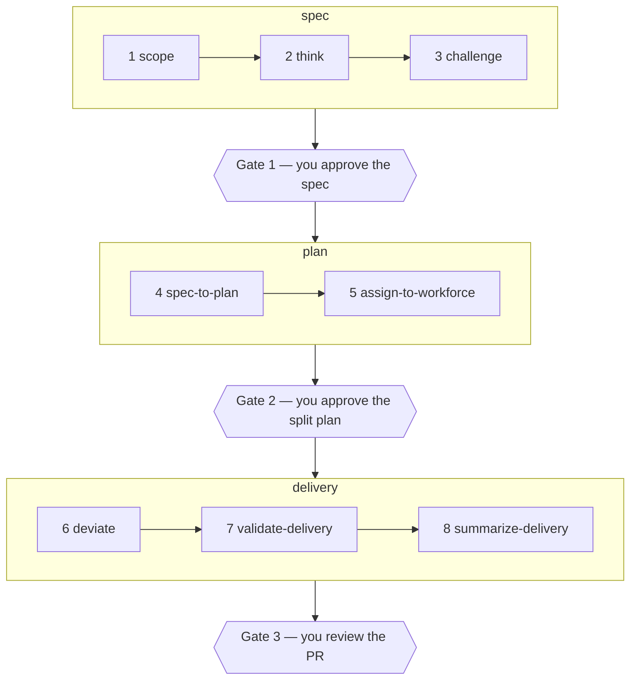

# associate

associate is a non-coding agent harness — a fast, reliable worker for **read,
summarize, and find** work across local files and the web. It exists to take
non-coding tool work off [`colleague`](https://github.com/agentculture/colleague)
so colleague can spend its budget on coding and thinking.

Modelled on the Pi harness, merged from colleague's base tools.

The name is not incidental: **`associate` is a first-class role in
[lobes](https://github.com/agentculture/lobes-cli)** — the tenth Colleague-facing
lobe, backed by `nvidia/NVIDIA-Nemotron-3.5-Lightning-30B-A3B-NVFP4` and defined
there as `worker` **minus** `repo_action`: it executes, drafts, inspects and calls
tools, then hands the result *back* rather than enacting it. This repo is the
agent harness for that role. The lane is live — a lobes gateway proxies it over
the tailnet to a Jetson AGX Orin 64GB running the `orin-associate` shape.

## The boundary: an opinionated Pi extension, not a fork

associate commits to [Pi](https://pi.dev) as its runtime rather than building
or forking a harness loop. The unit that gets optimized is **model + harness +
tools + context policy, together** — so what stays harness-independent is kept
small and portable, and everything else is tailored to Pi and to the served
model:

- **Portable (lives in the Python package, `associate/contract/`):** the role
  and permission boundaries (`role.json`'s capabilities/forbidden tokens,
  `policy.json`'s read denylist / shell allowlist / output budgets), the task
  input and handback JSON shapes, the evidence artifacts and their provenance
  (the walk and statements schemas), and the behavioral evaluation cases
  (`tests/behavioral/`).
- **Pi-and-model-tailored (lives with the Pi extension,
  `.pi/extensions/associate/`):** tool descriptions and schemas, result
  presentation, prompt construction and context selection, compaction,
  recovery and stopping behavior, and reasoning/provider settings.

A second harness is added only after a measured benefit — not speculatively,
and not because forking felt easier. Harness diversity, if it's ever needed,
lives at the Culture mesh's node boundary (a different agent runs a different
harness), not duplicated inside this one.

This is a change of plan from this repo's `culture-agent-template` origin.
**At the pre-change HEAD (commit `2f24585`)**, `culture.yaml` still declared
`backend: colleague`, no `.pi/` directory was tracked at all, and this section
literally read "Status: scaffold, not yet a harness" — that snapshot is
checkable with `git show 2f24585:README.md` from this repo's history. What has
landed since (the contract, the extension core, the containment library,
`associate bench --harness stub`) is real progress against that starting
point; what has **not** landed yet is a `pi` harness adapter that a live run
has measured end to end, so this repo does not yet claim the harness works —
see [`CLAUDE.md`](CLAUDE.md)'s "Current state vs. target" for the precise
landed-versus-pending split and the measured topology of the model lane.

### Three audiences, three invocation paths

Every reader of this repo needing to *use* the lane falls into one of three
buckets, each with one invocation meant to work from a clean clone:

1. **The mesh resident** — reached through Culture, `culture start associate`.
   That resolves `backend: acp`: culture spawns `pi-acp`, which bridges ACP
   stdio to `pi --mode rpc`, so the resident runs the same Pi binary and the
   same `.pi/extensions/associate` tool set a headless run does, with
   `AGENTS.md` as the runtime prompt. `AGENTS.colleague.md` is kept only until
   that path is fully verified.
2. **colleague, or an operator, driving it headlessly** — the intended
   invocation is `associate run --harness pi "<task>"`, but the `run` verb and
   the `pi` adapter are not wired yet (a later task in the same plan). What
   *does* work today is `uv run associate bench --harness stub`, which
   exercises the same behavioral corpus the `pi` adapter will run, against a
   plumbing-only stub — useful for verifying the wiring, not for getting real
   work done yet.
3. **A developer with `pi` on PATH** — from a checkout with the `ASSOCIATE_*`
   environment variables set (see [`CLAUDE.md`](CLAUDE.md)'s Tooling
   prerequisites for the full list and the exact `pi` / `pi-acp` / Node pins),
   running `pi` directly in the repo picks up the tracked `.pi/` project
   config and the associate extension.

### The lane boundary

Whichever invocation is used, the lane **reads, finds, summarizes, and
verifies — it never edits, writes, or opens a PR.** That is enforced
structurally, not just by prompt: the Pi extension's `defaultTools` omits
`edit`/`write` entirely, and a `tool_call` hook refuses any write outside a
per-session scratch directory. It mirrors the lobes `associate` role
(`worker` MINUS `repo_action`) described above.

## Quickstart

```bash
git clone https://github.com/agentculture/associate && cd associate
uv sync

uv run associate whoami               # who this agent is
uv run associate learn                # self-teaching prompt (add --json)
uv run associate bench --harness stub # behavioral-suite plumbing check
uv run pytest -n auto                 # the test suite
uv run teken cli doctor . --strict    # the agent-first rubric gate CI runs
```

## CLI

| Verb | What it does |
|------|--------------|
| `whoami` | Report this agent's nick, version, backend, and model from `culture.yaml`. |
| `learn` | Print a structured self-teaching prompt. |
| `explain <path>` | Markdown docs for any noun/verb path. |
| `overview` | Read-only descriptive snapshot of the agent. |
| `doctor` | Check the agent-identity invariants (prompt-file-present, backend-consistency). |
| `cli overview` | Describe the CLI surface itself. |
| `run [prompt]` | Run one task on a harness adapter (`pi` by default). Exits `2` **without serving** unless a preflight proves the extension loaded with no active writer tool. |
| `bench --harness <name>` | Run the behavioral suite against one adapter (`pi` or `stub`) and print a per-category pass/fail table. |

Every command takes `--json`. **Results go to stdout, errors and diagnostics go
to stderr — never mixed**, so an agent parsing the output can rely on it. Errors
in JSON mode are `{code, message, remediation}`; in text mode they are an
`error:` line and a `hint:` line. Exit codes: `0` success, `1` user error, `2`
environment error, `3+` reserved.

The runtime package has **no third-party dependencies** — it installs and starts
fast, which is the whole point of a harness.

### How `associate run` proves the lane is contained

Readiness is proven by a **preflight**, never by hoping the model calls a
sentinel tool mid-task. Each run is two `pi` invocations: the first adds
`-e <extension>/lib/preflight.ts`, an extension whose only handler ends the
process on `before_agent_start`, so pi loads every extension, fires
`session_start` — where the associate extension writes its readiness report to
`<export dir>/ready.json` — and exits before a single model request. The
launcher reads that file, refuses with exit `2` if it is missing or names an
active writer tool, and only then runs the real task turn. The extension is
passed explicitly with `-e <index.ts>` in both invocations, so the lane loads in
**any** checkout — a fixture repo, an unrelated project — instead of depending on
the examined checkout carrying its own `.pi/`; `ASSOCIATE_EXTENSION_PATH`
overrides which `index.ts` that is.

## What you get

- **An agent-first CLI** cited from [teken](https://github.com/agentculture/teken)
  (`afi-cli`), with the stdout/stderr, `--json`, error-shape, and
  learnability contract above enforced in CI by `teken cli doctor --strict`.
- **A mesh identity** — `culture.yaml` (`suffix` + `backend` + `model`) and the
  matching resident prompt file. associate runs `backend: acp`, launched
  through `pi-acp` (which bridges ACP stdio to `pi --mode rpc`), so the runtime
  prompt is [`AGENTS.md`](AGENTS.md) — the same context file Pi itself loads.
  [`AGENTS.colleague.md`](AGENTS.colleague.md) is retained only until the ACP
  path is fully verified, so backing the cutover out stays a single clean
  revert. [`CLAUDE.md`](CLAUDE.md) is the prompt for Claude Code sessions
  working *on* the repo. Both audiences are real.
- **19 skills** under `.claude/skills/`, vendored cite-don't-import. Provenance
  for every one is tracked in [`docs/skill-sources.md`](docs/skill-sources.md).
- **A build + deploy baseline** — pytest, four linters, markdownlint, the rubric
  gate, SonarCloud, and PyPI Trusted Publishing wired into GitHub Actions.

## Skills

Eight of the vendored skills form one workflow, not eight independent tools.
They come from [`devague`](https://github.com/agentculture/devague) and carry an
idea from vague to accounted-for:



Three gates are yours: the spec, the split plan, the PR. Inside them you also
adjudicate — every proposal the agent files waits for your confirm, and a mid-run
deviation waits for your approval. Everything else is the agent's, and all of it
is written down. Nothing is deleted to go green: unknowns are parked, questions
are resolved, failures are reported faithfully.

The other eleven cover the day-to-day:

| Skill | What it's for |
|-------|---------------|
| `cicd` | The PR lane — open, read review comments, reply, and gate on SonarCloud. |
| `communicate` | File issues on sibling repos and send messages to Culture mesh channels. |
| `ask-colleague` | Hand a scoped task to a *different* model for a genuinely independent second opinion. |
| `remember` / `recall` | Write to and search the shared eidetic memory store. |
| `run-tests` | pytest with parallel execution and coverage. |
| `version-bump` | Bump semver and prepend a CHANGELOG entry — required on every PR. |
| `sonarclaude` | Query the SonarCloud API directly. |
| `agent-config` | Show a Culture agent's full configuration in one read-only view. |
| `pypi-maintainer` | Switch a package install between PyPI, TestPyPI, and local editable. |
| `doc-test-alignment` | Verify committed docs still describe what the code does (stub today). |

## Environment

These `ASSOCIATE_*` variables are the whole external interface to the lane's
endpoint and session plumbing — no committed file names a host, a port, or a
bearer. All of them are optional; the defaults below are what applies when a
variable is unset.

| Variable | Default | Purpose |
|----------|---------|---------|
| `ASSOCIATE_BASE_URL` | `http://localhost:8001/v1` | OpenAI-compatible base URL the Pi provider and the bench talk to. |
| `ASSOCIATE_API_KEY` | — | Bearer for that endpoint. With it unset the extension registers no provider and prints one hint; `associate run` then says pi's own default model applies. Never committed, never logged. |
| `ASSOCIATE_MODEL` | `associate` | The lobes **role** name sent as `model` — never a checkpoint id. |
| `ASSOCIATE_REASONING_OFF` | `chat_template_kwargs` | Which reasoning-off field is injected on the wire: `chat_template_kwargs`, `reasoning_effort`, `both`, or `off`. |
| `ASSOCIATE_CONTRACT_DIR` | repo-relative `associate/contract/` | Where the extension and the Python adapter both load `role.json`, `policy.json`, and the schemas from. Set per run by `associate run`. |
| `ASSOCIATE_SESSION_ID` | generated | Pins the session id that keys the scratch and export directories, so concurrent runs never collide. |
| `ASSOCIATE_EXPORT_ROOT` | `.associate-runs` beside the checkout | Where the run's session directory (`<root>/<session id>/export`) is created — always outside the examined checkout. |
| `ASSOCIATE_CONTINUE_FROM` | — | A prior run's export directory, loaded as this session's first context instead of re-walking it. Set by `associate run --continue-from`. |
| `ASSOCIATE_INJECT_PROMPT` | — | Set to `1` by `associate run`: with pi's ancestor context-file discovery turned off, the extension injects the checkout's own `AGENTS.md` and nothing above it. |
| `ASSOCIATE_EXTENSION_PATH` | the `.pi/extensions/associate/index.ts` above the installed package | The extension entry point `associate run` hands pi with `-e`, in both the preflight and the task turn. |

The launcher checks the installed `pi` against the tested pin (**0.84.2**) and
warns on stderr naming that version — it never refuses on a version number
alone.

## Optional tooling

The CLI needs none of this. Individual skills do, and each degrades with a clear
install hint rather than blocking a clone that never uses it:
`devex` (>=0.21) for `cicd`, `agtag` (>=0.1) for `communicate`, `devague`
(>=0.24) for the eight-skill chain, `colleague` for `ask-colleague`, and
`eidetic` (>=0.10.0) for `remember` / `recall`.

## Contributing

Every PR bumps the version — including docs-only and CI-only changes. CI enforces
it. Vendored skills are never patched in place; fixes go upstream and come back
on the next sync. Both rules, and the CLI contract you must not break, are in
[`CLAUDE.md`](CLAUDE.md).

## License

Apache 2.0 — see [`LICENSE`](LICENSE).
